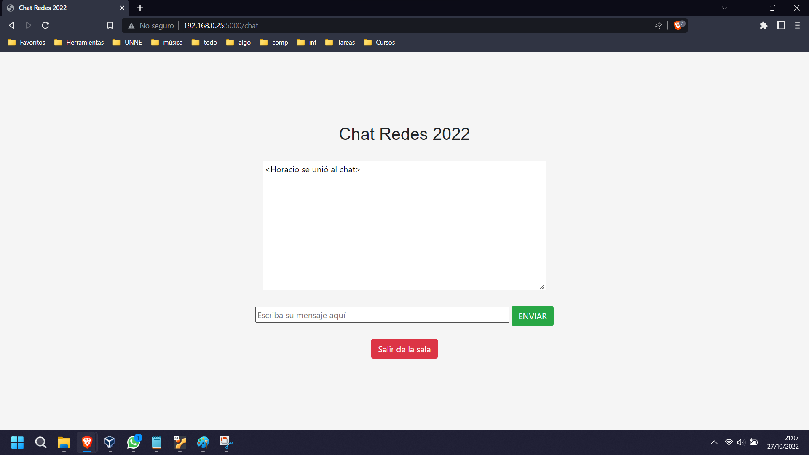

# LAN Chat App 

Local network chat web app. Written in Python with Flask, Socket.IO and Eventlet.

## Technologies used

- Python
- Flask
- Socket.IO
- Werkzeug
- Eventlet

## Build instructions

The system will be mounted on Linux. 

First of all, make sure you have Python installed. If you don't, then install it with:

```bash
$sudo apt-get update
$sudo apt-get install python3
```

Once Python has been installed. You must install the following modules with the `pip` package manager:

```bash
$pip install Flask==1.1.2
$pip install Flask-Session==0.3.2
$pip install Flask-SocketIO==4.3.1 
$pip install python-engineio==3.13.2 
$pip install python-socketio==4.6.0 
$pip install Werkzeug==2.1.0
$pip install eventlet
```

\* Versions used may vary in each case, but this combination has been proven to ensure compatibility

Now you can `clone` the repo:

```bash
git clone https://github.com/horazini/Chat-LAN

# change directory
cd Chat-LAN
```

Once you are inside the `./Chat-LAN` directory, you can run the app with:

```bash
sudo flask run -h <your local IP>

```

Which should then print ```Running on http://<your local IP>:5000``` 

### Accessing the app

While the server is running, the app should be accessed from the browsers of any device connected to the same local network as the machine running the server, by entering \<server machine IP>:PORT in the address bar.

## Screenshot 





